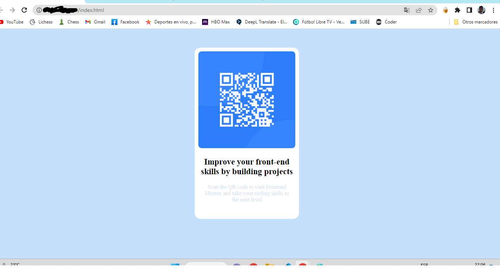

# Frontend Mentor - QR code component solution

This is a solution to the [QR code component challenge on Frontend Mentor](https://www.frontendmentor.io/challenges/qr-code-component-iux_sIO_H). Frontend Mentor challenges help you improve your coding skills by building realistic projects. 

## Overview

### Screenshot

## My process
I started building the html structure where I used div, h2 and h3.
Then go to the css, in this case I used background color, margin, padding and Flexbox
I didn't see that was important use "mediasqueries"

### Built with

- Semantic HTML5 markup
- CSS custom properties
- Flexbox

### Continued development
Keep learning and practice Flexbox
